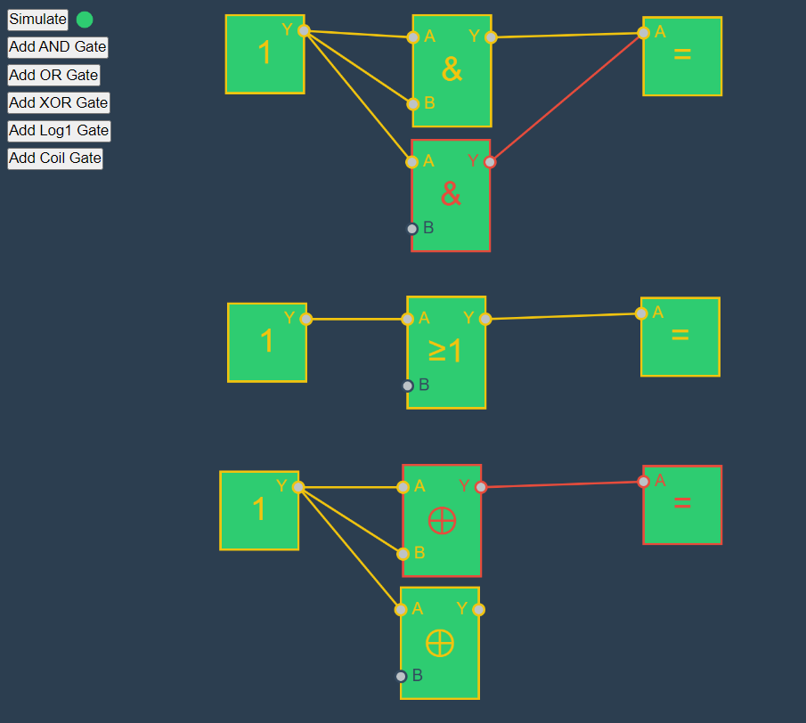

# Boolean Simulator
A crude logic circuit simulator implemented with p5.js, typescript and webpack

## Usage
- Run `npm install`
- Run `npm run start`

## ToDo
- [ ] Embedd Simulation mode in `IAppContext`. When adding edges while the simulation is running, the start & target `Connector`s border is flickering (since the state is overwritten with `EState.idle` / `EState.log1`)
- [ ] Evaluate multiple Edges on one input / output. Probably a bigger issue, since the logic is evaluated in the `SimulatedEdge` class
- [ ] Make deletion of edges possible
- [ ] Make deletion of gates possible